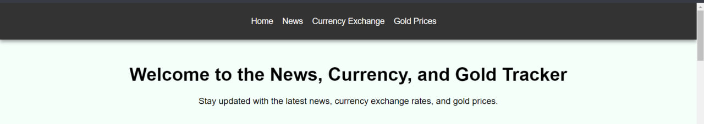
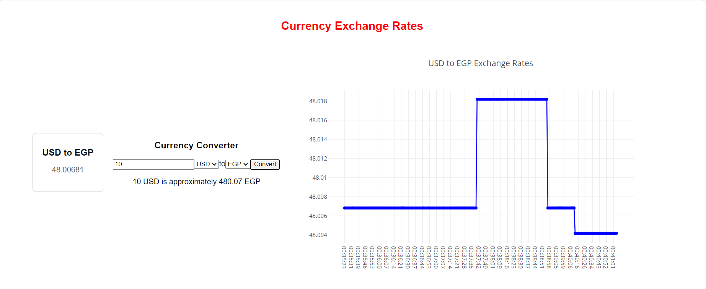
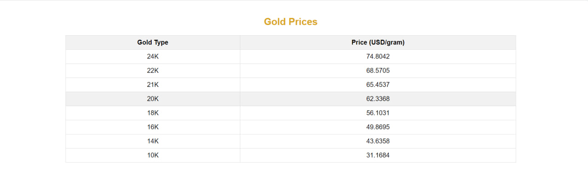

#  Getting Started with Create React App 

This project was bootstrapped with [Create React App](https://github.com/facebook/create-react-app) .

## Run Application

In the project directory, you can run:

### `npm start`

Runs the app in the development mode.\
Open [http://localhost:3000](http://localhost:3000) to view it in your browser.

The page will reload when you make changes.\
You may also see any lint errors in the console.

##  Application Sections 

Application consists three main section News, Currency Exchange Rates, and Gold Prices Tracker

###  News: 

A feature that allows users to browse and read news articles from various sources. Users can filter news by category or search for specific topics of interest.

###  Currency Exchange Rates:: 

This feature enables users to track and compare currency exchange rates between Egyptian Pound (EGP) and US Dollar (USD) in real-time. Users can view historical data and trends, helping them make informed financial decisions.

###  Gold Prices Tracker (in EGP): 

Users can monitor recent gold prices in Egyptian Pound (EGP). The feature provides current prices, historical trends, and graphical representations to visualize price fluctuations over time

##  How Each one Actually Works 

The header component serves as the navigation bar for the application, providing easy access to different sections. It typically includes links for navigating between news browsing, currency exchange rates, and gold prices tracking features.

###  News: 

#### News Service:

The newsService.js file defines a function fetchNews that fetches top headlines from the News API (https://newsapi.org/v2/top-headlines). It uses Axios for making HTTP requests and requires an API key (2befa5a94f3a4aa59d8368ca7a22c065) passed as a query parameter (apiKey). Upon successful retrieval of data, it returns an array of article objects (response.data.articles). If fetching fails, it logs an error and returns an empty array.

#### News Component:

The News component in React fetches and displays top news articles using the fetchNews function from newsService.js. It utilizes React's useState and useEffect hooks to manage component state and fetch data asynchronously upon component mount. Once data is fetched, it dynamically renders a grid layout (grid-container-newes) where each news article is displayed as a card (grid-item). Each card includes:

- An image (article.urlToImage) representing the article (if available).
- The article's title (article.title).
- The article's author (article.author).
- A button (Read More) that opens the full article in a new tab when clicked (window.open(article.url, "\_blank")).

#### Final Look

###  Currency Exchange Rates:: 

#### Currency Service (currencyService.js):

- The currencyService.js file defines a function fetchCurrencyRates that fetches real-time currency exchange rates from the FastForex API (https://api.fastforex.io/fetch-all). It uses Axios for making HTTP requests and requires an API key (cb8991e2ea-18b7bfe4b9-sfqvsn) passed as a query parameter (api_key). Upon successful retrieval of data, it returns the exchange rate for Egyptian Pound (EGP) relative to USD (response.data.results.EGP). If fetching fails, it logs an error and returns null.

#### Currency Rates Component (CurrencyRates.js):

- The CurrencyRates component in React fetches and displays real-time currency exchange rates using the fetchCurrencyRates function from currencyService.js. It utilizes React's useState and useEffect hooks to manage component state and fetch data asynchronously upon component mount. Features include:

  - Displaying the current exchange rate from USD to EGP fetched from the service.
  - A currency converter section allowing users to input an amount in USD or EGP and convert it to the other currency based on the fetched exchange rate.
  - Dynamic conversion results displayed after clicking the Convert button.
  - Integration with CurrencyChart component to display a real-time exchange rate chart based on historical data fetched continuously in the background.

#### Currency Changes Over Time Component (CurrencyChart.js):

- The CurrencyChart component in React displays a real-time exchange rate chart using Plotly and Axios. It receives fromCurrency and toCurrency props to specify the currencies for which the exchange rate is displayed. Features include:
  - Fetching historical exchange rate data every 10 seconds (useInterval hook) from the FastForex API based on the selected currencies.
  - Displaying a line chart using Plotly to visualize historical exchange rates over time, with time on the x-axis and exchange rate on the y-axis.
  - Continuously updating the chart with the latest data fetched, providing users with real-time insights into currency exchange rate fluctuations between USD and EGP.

#### Final Look

###  Gold Prices Tracker (in EGP): 

#### Gold Service:

This service file (goldService.js) defines a function fetchGoldPrices that fetches real-time gold prices in USD per gram from a specified API endpoint (https://www.goldapi.io/api/XAU/USD). It uses Axios for making HTTP requests and requires an API key (goldapi-rgclisly0i0oop-io) passed as a header (x-access-token). Upon successful retrieval of data, it returns the parsed JSON response containing gold prices or logs an error if fetching fails.

#### Gold Prices Component (GoldPrices.js):

The GoldPrices component in React fetches and displays real-time gold prices in USD per gram using the fetchGoldPrices function from goldService.js. It utilizes React's useState and useEffect hooks to manage component state and fetch data asynchronously upon component mount. Once data is fetched, it dynamically renders a table displaying different types of gold prices filtered based on their key names (price*gram*\*). Each row in the table represents a specific type of gold (e.g., 24k, 18k) alongside its current price per gram.

#### Final Look

